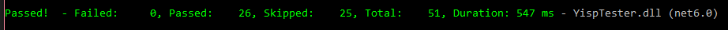

[//]: # (Hey!! This document is best viewed on GitHub: https://github.com/resistiv/YispSharp)

# YispSharp
YispSharp is a C# implementation of a Lisp interpreter, created using [*Crafting Interpreters* by Robert Nystrom](https://craftinginterpreters.com/) as a guide. This project was developed primarily as an assignment for CS 403/503 - Programming Languages (Fall 2023) at the University of Alabama. The interpreter works on a dialect of Lisp established by our professor, Don Yessick, called Yessick's Lisp or Yisp for short.

The instructions provided for this project can be found [here](/Instructions.md), and some notes on the grammar used to build this interpreter can be found [here](/Grammar.md).

### Table of Contents
1. [Usage](#usage)
2. [Building](#building)
3. [Testing](#testing)
    1. [Tests Outline](#tests-outline)

## Usage
When run without an argument, Y# operates as a <abbr title="read-eval-print loop">REPL</abbr> prompt which runs until it encounters an exit code. Otherwise, when given a Yisp source file, Y# will attempt to execute it and then exit.
```
YispSharp [Yisp script]
```

## Building
Building and running YispSharp requires the .NET 6.0 SDK. It can be installed via a package manager, such as ``apt`` or ``snap``, or from the [.NET download website](https://dotnet.microsoft.com/en-us/download/dotnet/6.0).
```
sudo apt-get install dotnet-sdk-6.0
```
On Windows, it can be installed via the Windows Package Manager, ``winget``, or from the aforementioned download site.
```
winget install Microsoft.DotNet.SDK.6
```
Once installed, clone the repository to a location of your choosing.
```
git clone https://github.com/resistiv/YispSharp.git
```
Navigate to the folder containing the file ``YispSharp.sln``, and run the following:
```
dotnet build
```
The resulting executables will be built to the ``bin`` subfolders of each project within the solution, from which they can be run.

## Testing
This project adapts several of [Robert Nystrom's Lox unit tests](https://github.com/munificent/craftinginterpreters/tree/master/test) to Yisp.

Tests can be built and run using the following command in the root of the repository:
```
dotnet test
```
The number of successful and failed tests will be displayed. Of important note, some tests will be noted as being skipped; these test sets were used early in development for things like Scanner and Parser testing, and are no longer applicable in the program's current state, thus they are NOT failed tests.

As of commit ``4718a06``, everything builds, runs, and all tests pass on Windows 10.


### Tests Outline
For each built-in function or operation, there is an individual test with cases testing a range of correct and incorrect usages. All of these tests are fairly simple and are made to test the basic functionality of these operations.

Three more complex tests are used to ensure everything is in proper working order. Due to the size of the code for these tests, separate source files are located under the ``YispTester/TestFiles`` directory with proper comments and documentation.
* **Blackjack**: Taken from the Blackjack assignment earlier in the semester, this tests comparisons, list manipulation, and recursion.
* **Bowling**: Taken from the Bowling assignment earlier in the semester, this tests comparisons, function definitions & lazy evaluation, list manipulation, and recursion.
* **Fibonacci**: A Fibonacci number calculator which tests comparisons and recursion.
